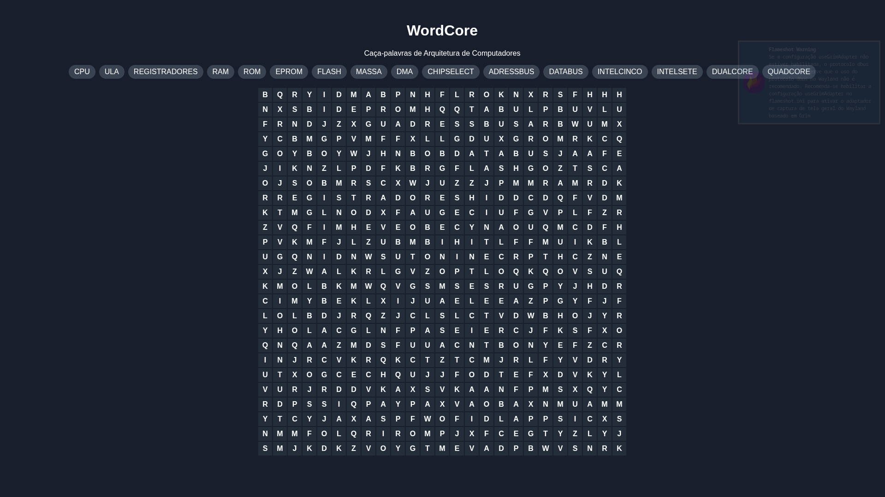

# WordCore

Aplicação web de caça-palavras desenvolvida em JavaScript, com foco em conceitos de arquitetura de computadores e microprocessadores.

O projeto gera dinamicamente matrizes preenchidas com termos técnicos da computação, distribuindo palavras horizontal e verticalmente para criar uma experiência interativa de aprendizado.




## Sobre o projeto

O **WordCore** foi desenvolvido com o objetivo de unir lógica de programação e conceitos de arquitetura computacional em uma aplicação interativa.

A aplicação cria automaticamente um caça-palavras com palavras relacionadas a hardware, organização de computadores e microprocessadores, posicionando os termos de forma aleatória em uma matriz dinâmica.


## Funcionalidades

- Geração dinâmica de matriz **25x25**
- Distribuição automática de palavras
- Posicionamento horizontal e vertical
- Preenchimento automático com letras aleatórias
- Interface interativa
- Seleção visual das células
- Renderização dinâmica via JavaScript


## Tecnologias utilizadas

- **HTML5**
- **CSS3**
- **JavaScript**


## Conceitos abordados

O jogo utiliza termos relacionados à arquitetura de computadores, como:

- CPU
- ULA
- Registradores
- RAM
- ROM
- EPROM
- DMA
- Flash
- Dual Core
- Quad Core
- Address Bus
- Data Bus

## Estrutura do projeto

```bash
word-core/
│── index.html
│── style.css
│── js/
│   │── game.js
│   │── matriz.js
│   └── render.js
│── assets/
│   └── wordcore.png
```

---

## Como executar

Clone o repositório:

```bash
git clone <url-do-repositorio>
```

Acesse a pasta:

```bash
cd word-core
```

Abra o arquivo:

```bash
index.html
```

## Objetivo educacional

O WordCore foi criado como prática de:

- Manipulação de matrizes em JavaScript
- Algoritmos de posicionamento aleatório
- Manipulação do DOM
- Estruturação de aplicações web
- Aplicação de conceitos computacionais em jogos educativos

## Preview

O tabuleiro é gerado dinamicamente a cada execução, tornando cada partida única.

## Desenvolvido por: 

<p align="center">
  
  <p align="center" style="font-size: 25px"><strong>Raphael Canuto</strong><p>
</p>